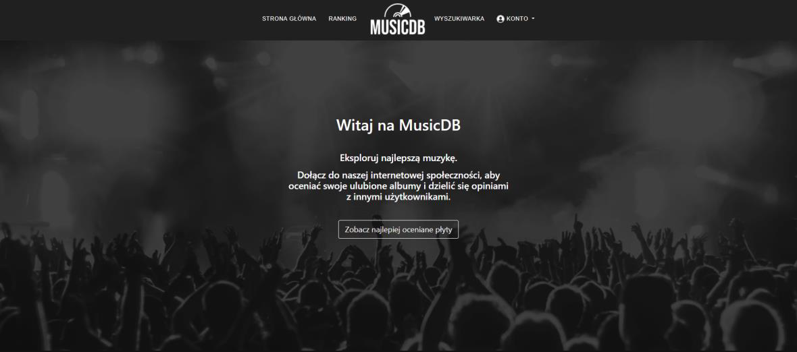
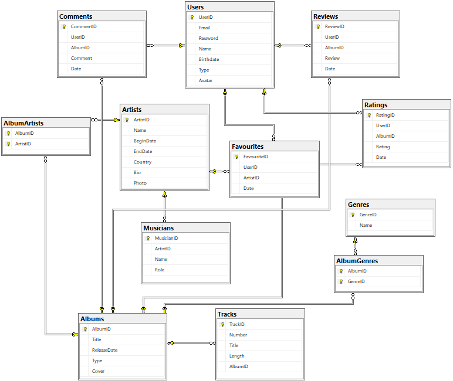

# Music Database

## Table of contents
* [General info](#general-info)
* [Technologies](#technologies)
* [Features](#features)
* [Database](#database)
* [Setup](#setup)

## General info
Web app for managing the discography database system.
	
  
## Technologies
Project was created with:
* HTML5
* CSS3
* Bootstrap 5
* JavaScript
* Transact-SQL
* C#
* ASP.NET MVC 5
* ADO.NET
* Entity Framework

## Features
* rate music albums
* write reviews and comments
* add artists to favourities
* search for new artists and their discography

## Database

## Setup
To run this project, install it using setup file located in Setup folder.
